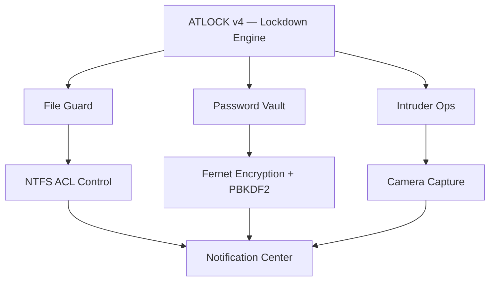

**The Total Security Suite for Windows.**
One `.exe`. Zero installers. Zero compromises.

  
  
  
  

  
  
  
  

 

Direct download · no sign-up · no ads

  

  <a href="#-features">Features</a> ·
  <a href="#-installation">Installation</a> ·
  <a href="#-faq">FAQ</a> ·
  <a href="#-roadmap">Roadmap</a>

 

  

---

## 🧭 What is ATLOCK?

> *"We build what others forgot to fix."* — Akhouri Systems

ATLOCK is a **Total Security Suite for Windows** — built by one developer who got tired of half-baked "lock apps" that promise security and deliver a password prompt.

- 📦 Single portable `.exe`
- 🚫 No installation, no setup wizard
- ▶️ Download → Run → Done

 

## 📋 Table of Contents

- [Windows Defender Warning](#️-windows-defender-warning--this-is-a-false-positive)
- [Features](#-features)
- [Security Hardening](#️-security-hardening)
- [Architecture](#-architecture)
- [Installation](#-installation)
- [What's New in v4.0](#-whats-new-in-v40)
- [FAQ](#-faq)
- [Roadmap](#-roadmap)
- [Disclaimer](#️-disclaimer)
- [License](#-license)
- [About](#️-about)

 

## ⚠️ Windows Defender Warning — This Is a False Positive

Windows may flag ATLOCK as an *"unrecognized app"* or *suspicious*. This is a well-known false positive for unsigned, PyInstaller-built Python applications — **it is not malware.**

<b>🛠️ How to run it anyway</b>

 

1. Click **"More info"** on the SmartScreen warning
2. Click **"Run anyway"**
3. ATLOCK opens normally ✅

> Code signing is on the [roadmap](#-roadmap) to remove this warning entirely.

 

## ✨ Features

<table>
<tr>
<td width="50%" valign="top">

### 🔒 System Lockdown
Lock your entire system for a set duration. Once locked — no bypass, no escape.
- `Alt + Tab` blocked
- `Win` key blocked
- Task Manager killed on sight
- One emergency unlock available — use it wisely

</td>
<td width="50%" valign="top">

### 🛡️ File Guard
NTFS ACL-level file locking — the deepest access control Windows allows.
- Protected files can't be opened, moved, copied, or deleted, not even by admins
- Guard up to **10 files** simultaneously
- 3 wrong attempts trigger the intruder response

</td>
</tr>
<tr>
<td width="50%" valign="top">

### 🔑 Password Vault
Local, **AES-encrypted** (Fernet) storage for anything sensitive — emails, UPI PINs, bank details.
- Master password hashed with **PBKDF2-HMAC-SHA256**, 200,000 iterations
- 3 wrong attempts → warning
- 4th wrong attempt → **10-hour hard lockout** on the entire app
- All attempts masked before logging — never stored in plaintext

</td>
<td width="50%" valign="top">

### 📸 Intruder Ops
Every wrong attempt gets a response.
- 📷 Photo captured on the 1st wrong attempt
- 🎥 10-second video captured on escalation (3rd/4th wrong)
- 🔊 Audible alarm on critical intrusion
- Auto-saved to your Pictures / Videos gallery

</td>
</tr>
<tr>
<td width="50%" valign="top">

### 🔔 Security Notification Panel
A real-time, in-app notification center.
- Every security event logged: failed unlocks, intruder attempts, file guard triggers
- Auto-deleted after 24 hours
- Live unread badge counter

</td>
<td width="50%" valign="top">

### ⚙️ Settings & Control
Full control from one clean panel.
- Toggle photo / video capture
- Toggle sound & alarm tones
- Jump straight to the intruder media gallery
- Live dependency/status check

</td>
</tr>
</table>

 

## ⚔️ Security Hardening

| Mechanism | What it does |
|---|---|
| Low-level `WH_KEYBOARD_LL` hook | Blocks `Alt+Tab`, `Win`, `Esc`, `Alt+F4` system-wide during lockdown |
| Background watchdog thread | Instantly kills Task Manager, Process Hacker, ProcExp |
| Continuous focus enforcement | `grab_set()` + `focus_force()` loop — no window can steal focus |

 

## 🏗️ Architecture

 

## 📦 Installation

1. Download `ATLOCK_v4.exe` from the [Releases page](https://github.com/Akhouri-Anmol-Kumar/ATLOCK/releases/latest)
2. Extract it (if zipped)
3. Run `ATLOCK_v4.exe`

**That's it.** No Python required. No installation. No admin setup.

| Requirement | Details |
|---|---|
| OS | Windows 10 or later |
| Runtime | None — fully bundled |
| Camera | Optional, enables Intruder Ops photo/video capture |

 

## 🆕 What's New in v4.0

- 🔐 Password Vault re-engineered with real AES encryption (Fernet + PBKDF2, 200k iterations), replacing the old, weaker encoding scheme
- 🧹 Removed external Gmail/Telegram alert integrations for a leaner, fully self-contained app — zero external accounts, tokens, or internet dependency required
- 🎬 Refined Intruder Ops pipeline (photo → escalation → video → alarm)
- 🖥️ Redesigned Settings panel

 

## ❓ FAQ

<b>Is ATLOCK safe to run?</b>

 
Yes. It's a locally-run, offline security tool. The Defender warning is a standard false positive for unsigned PyInstaller apps, not a sign of malicious behavior.

<b>Does ATLOCK send my data anywhere?</b>

 
No. As of v4.0, ATLOCK has zero external integrations — everything (vault, photos, videos, logs) stays on your machine.

<b>What happens if I forget my master password?</b>

 
There is currently no recovery mechanism by design, this is what makes the vault secure. Store your master password somewhere safe before relying on ATLOCK.

<b>Can I unlock a guarded file in an emergency?</b>

 
System Lockdown includes one emergency unlock. File Guard does not currently have a bypass, that's the point of ACL-level locking. Be careful about which files you guard.

 

## 🗺️ Roadmap

- [ ] Code signing to eliminate the SmartScreen warning
- [ ] Configurable lockdown/unlock schedules
- [ ] Encrypted cloud backup for the vault (opt-in)
- [ ] Multi-monitor lockdown support

 

## ⚠️ Disclaimer

ATLOCK is intended for personal device security on machines you own or are authorized to manage. Features like Task Manager termination, keyboard hooking, and camera-based intruder capture are powerful, use responsibly and in compliance with local laws and workplace policies. The developer is not responsible for data loss resulting from forgotten passwords or misuse of the lockdown/file-guard features.

 

## 🤝 Contributing

Issues and feature requests are welcome via the [Issues tab](https://github.com/Akhouri-Anmol-Kumar/ATLOCK/issues). Pull requests are welcome, please open an issue first to discuss significant changes.

 

## 📄 License

Licensed under the **MIT License** — see [LICENSE](LICENSE) for details.

 

## 🏛️ About

**ATLOCK** is a product of **Akhouri Systems** — a desktop software company built on one idea:
*if existing software frustrates you, build something better.*

Developed solely by **Akhouri Anmol Kumar** · Indian Software Developer

An Akhouri Systems Product

